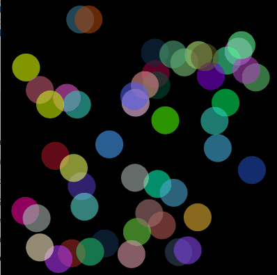
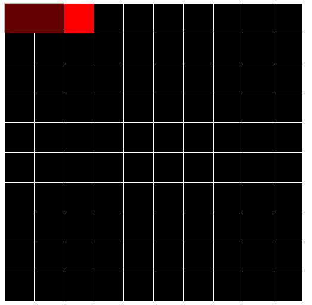
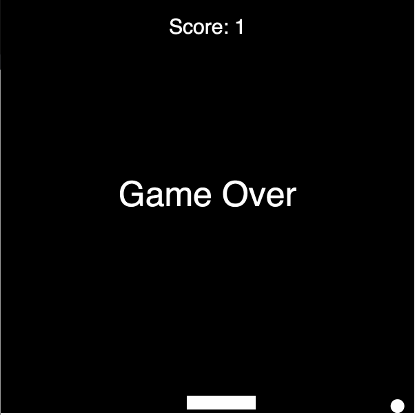
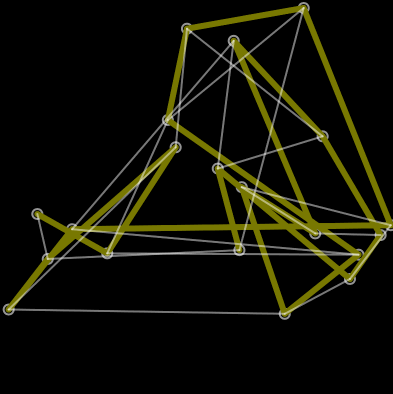
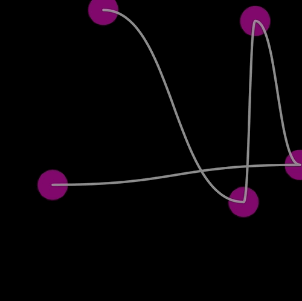
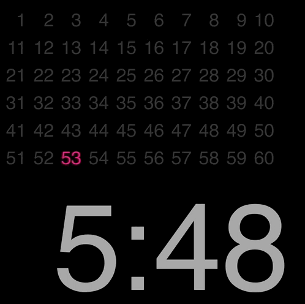

# Bouncing balls
Kind of an `Hello world` with P5.js

# Maze Generator

"Recursive backtracker" alghorithm implementation

# Break Out
Breakout or 1 player pong?

# Travelling Salesman
The worst solution ever to solve the travelling salesman problem

# Bezier curve
An attempt to generate looking good bezier curves

# Clock
